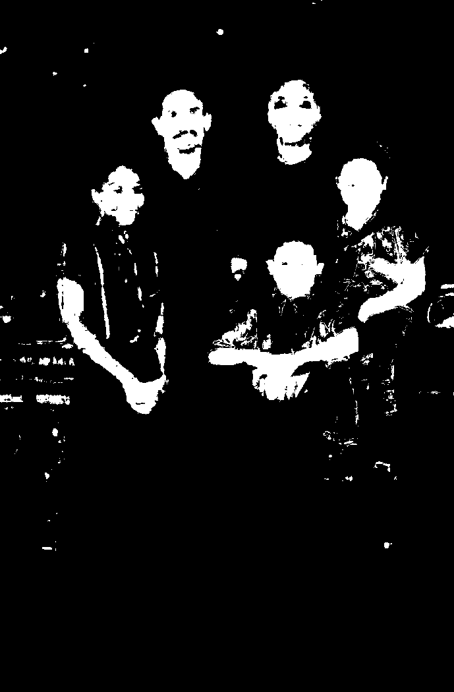

# Adaptive rule based skin detector

Detecting human skin using thresholds.

The main idea was to make the original work more accessible by implementing the algorithm in Python while keeping a fast execution time through vectorization.  
The differences with the original work are explained [in a section below](#differences-from-original-work).


#### Original Paper
N. Brancati, G. De Pietro,M. Frucci, and L. Gallo. “Human skin detection through correlation rules between the YCb and YCr subspaces based on dynamic color clustering”. Computer Vision and Image Understanding 155, 2017, pp. 33–42.
https://doi.org/10.1016/j.cviu.2016.12.001

#### Credits
Credits to the authors of the original version: 
https://github.com/nadiabrancati/skin_detection/


## Outcomes

Keep in mind that some images will be more difficult to classify than others: materials with *skin-like colors* (wood, copper, leather, clay), conditions that *modify an image appearance* (lighting, camera color science, motion blur), and the *wide range of skin tones* that the human skin may assume represent the main challenges of skin detection.  

Furthermore, these outcomes are not representative in any way of detector performance, as they were not carefully chosen; see [the relative section](#performance) for general performance.


<h3 align="center">

Samples from Pratheepan [[5]](#ref-pratheepan) dataset

</h3>
<br />
<div align="center">
    
    
</div>
<br />
<div align="center">
    
    
</div>
<br />
<div align="center">
    
    
</div>

<br />
<h3 align="center">

Samples from Abd [[4]](#ref-abd) dataset

</h3>
<br />
<div align="center">
    
    
</div>
<br />
<div align="center">
    
    
</div>
<br />
<div align="center">
    
    
</div>


## Usage

#### Setup

Install pip requirements 
```bash
pip install -r requirements.txt
```

#### Skin Detection

Predict skin pixels of an image
```bash
python skin_ycbcr.py image_in.jpg image_out.png
```


## Skin detection algorithm

The skin pixels clusters assume a trapezoidal shape in the YCb and YCr color subspaces.  Moreover, the shape and size of the trapezium vary according to many factors, such as the illumination conditions.
In high illumination conditions, the base of the trapezium results larger.  

Besides, the chrominance components of a skin pixel P with coordinates (P<sub>Y</sub>, P<sub>Cb</sub>, P<sub>Cr</sub>) in the YCbCr space exhibit the following behavior: the further is the (P<sub>Y</sub>, P<sub>Cr</sub>) point from the longer base of the trapezium in the YCr subspace, the further is the (P<sub>Y</sub>, P<sub>Cb</sub>) point from the longer base of the trapezium in the YCb subspace, and vice versa.

The aforementioned observations are the base of the method: it tries to define image-specific trapeziums in the YCb and YCr color subspaces and then verifies that the correlation rules between the two subspaces reflect the inversely proportional behavior of the chrominance components.

<br/>
<div align="center">
  
  <br>
  Computation of the correlation rules parameters. Adapted from the original paper (Brancati et al. 2017)
</div>
<br>

Algorithm overview  
1. Input image RGB to YCbCr
2. Cr<sub>max</sub> and Cb<sub>min</sub> computation
3. **Image-wise** computation of the correlation rules parameters
4. **Image-wise** correlation rules check


## Differences from original work

#### Vectorization

In the original work, the last two points described in the algorithm overview are computed pixel-wise.  

In this work, **vectorization** is applied to make the python implementation a lot faster.  

While vectorization improved execution time, the computation of vertices of the trapezium is still not optimized and is run by the python interpreter, taking up to 95% of the execution time and making it a lot slower than the original C implementation.

```
ncalls  tottime  percall  cumtime  percall filename:lineno(function)
1       0.008    0.008    0.403    0.403   skin_ycbcr.py:171(skin_detect)
2       0.370    0.185    0.389    0.195   skin_ycbcr.py:86(calculateValueMinMaxY)
```
<div align="center">
  python -m cProfile -s cumtime skin_ycbcr.py img_in.jpg img_out.png
</div>


#### Data types

Detection performance could be improved by being more consistent with data types, since the difference in accuracy with the original work is only given by the various casting operations performed on the matrices.


## Performance

The metrics are calculated as follows.  
Initially, the metrics are measured for all the instances, then the average and population standard
deviation for each metric are computed.


#### Performance on single databases
For each dataset: predictions are performed on the test set.  

|             | ECU [[1]](#ref-ecu) | HGR [[2]](#ref-hgr) | Schmugge [[3]](#ref-schmugge) | Abd [[4]](#ref-abd)
| ---:            | :---:              | :---:  | :---: | :---: |
| F<sub>1</sub> ↑       | 0.6302 ± 0.24 | 0.7331 ± 0.27 | 0.4218 ± 0.34 | 0.8449 ± 0.19 |
| IoU ↑                 | 0.5024 ± 0.24 | 0.6432 ± 0.30 | 0.3253 ± 0.27 | 0.7660 ± 0.21 |
| D<sub>prs</sub> [[6]](#ref-dprs) ↓     | 0.5411 ± 0.32 | 0.4015 ± 0.37 | 0.8232 ± 0.47 | 0.3292 ± 0.31 |


Here are the differences in detection performance with the original work recorded on the same sets.

| | ECU F<sub>1</sub> | ECU D<sub>prs</sub> | HGR F<sub>1</sub> | HGR D<sub>prs</sub> |
| ---:            | :---: | :---: | :---: | :---: |
| Original Work   | 0.6356 | 0.5340 | 0.7362 | 0.3936 |
| Implementation  | 0.6302 | 0.5411 | 0.7331 | 0.4015 |
| | | | | |
| Change          | 0.0054 | 0.0071 | 0.0031 | 0.0079 |


## Bibliography

| Ref   | Publication |
| :---  | :--- |
| 1<br id="ref-ecu" />   | Phung, S., Bouzerdoum, A., & Chai, D. (2005). Skin segmentation using color pixel classification: analysis and comparison. IEEE Transactions on Pattern Analysis and Machine Intelligence, 27(1), 148-154. https://doi.org/10.1109/tpami.2005.17  |
| 2<br id="ref-hgr" />  | Kawulok, M., Kawulok, J., Nalepa, J., & Smolka, B. (2014). Self-adaptive algorithm for segmenting skin regions. EURASIP Journal on Advances in Signal Processing, 2014(1). https://doi.org/10.1186/1687-6180-2014-170 |
| 3<br id="ref-schmugge" />  | Schmugge, S. J., Jayaram, S., Shin, M. C., & Tsap, L. V. (2007). Objective evaluation of approaches of skin detection using ROC analysis. Computer Vision and Image Understanding, 108(1-2), 41-51. https://doi.org/10.1016/j.cviu.2006.10.009 |
| 4<br id="ref-abd" />  | Topiwala, A., Al-Zogbi, L., Fleiter, T., & Krieger, A. (2019). Adaptation and Evaluation of Deep Learning Techniques for Skin Segmentation on Novel Abdominal Dataset. 2019 IEEE 19th International Conference on Bioinformatics and Bioengineering (BIBE). https://doi.org/10.1109/bibe.2019.00141 |
| 5<br id="ref-pratheepan" />  | Tan, W. R., Chan, C. S., Yogarajah, P., & Condell, J. (2012). A Fusion Approach for Efficient Human Skin Detection. IEEE Transactions on Industrial Informatics, 8(1), 138-147. https://doi.org/10.1109/tii.2011.2172451 |
| 6<br id="ref-dprs" /> | Intawong, K., Scuturici, M., & Miguet, S. (2013). A New Pixel-Based Quality Measure for Segmentation Algorithms Integrating Precision, Recall and Specificity. In International Conference on Computer Analysis of Images and Patterns (pp. 188-195). Springer, Berlin, Heidelberg. https://doi.org/10.1007/978-3-642-40261-6_22 |

